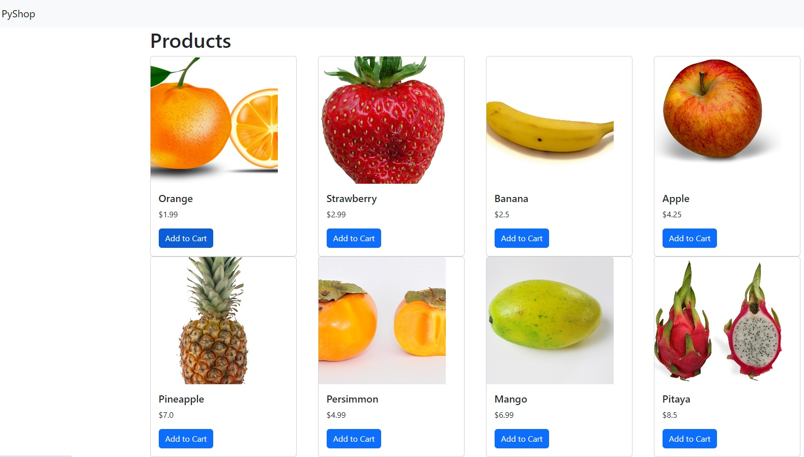

# PyShop Website Made in Django



A basic website made in Django. It features a products page with product cards that include images and prices.
The built in admin page allows the superuser to change product prices, quantities and images. This was my first website building project.

## Requirements
```bash
pip install django==4.2
```

## Usage
```bash
python manage.py runserver
```
## Author
Alex McKinley
